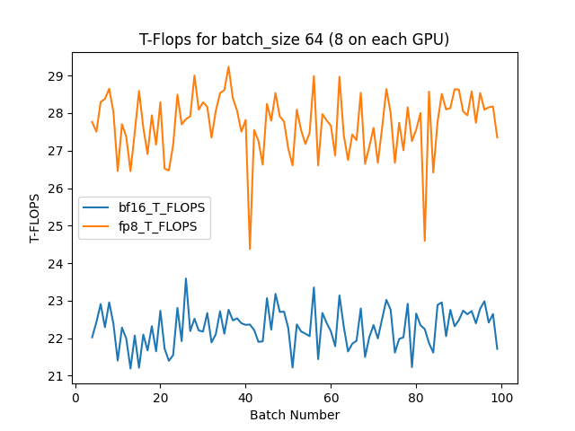
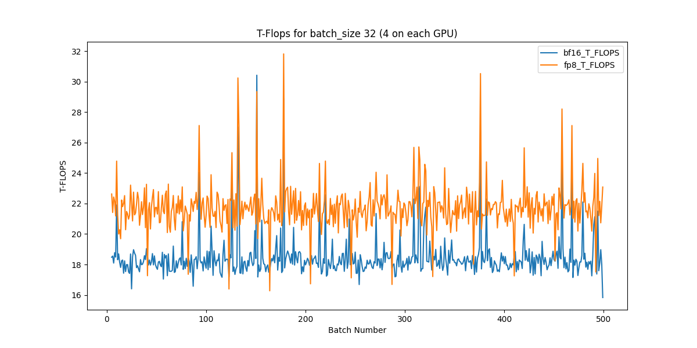

# h100 testing scripts

This repository tested the T-FLOPS on an 8xH100 node, gratiously provided by CoreWeave. 

## To run:

1. Clone this repository
2. Install requirements `pip install -r h100-stuff/requirements.txt` (and ensure you have `git-lfs` installed. [See here for directions](https://askubuntu.com/questions/799341/how-to-install-git-lfs-on-ubuntu-16-04))
3. `wandb login` to track with wandb
4. `accelerate launch --config_file h100-stuff/fp8.yml h100-stuff/run_summarization_no_trainer.py --model_name_or_path t5-large --dataset_name cnn_dailymail --dataset_config "3.0.0" --source_prefix "summarize: " --output_dir tst-summarization --per_device_train_batch_size=4 --per_device_eval_batch_size=4  --with_tracking --report_to "wandb" --max_train_steps 100`

## Report

For the full Weights and Biases log, please check out the workspace [here](https://wandb.ai/muellerzr/summarization_no_trainer?workspace=user-muellerzr).

Overall we saw a 25% increase in terms of FLOPS comparing bf16 to fp8 on the H100's. Below are two graphs comparing the T-FLOPS at different batch sizes, one at 8 per GPU (64 actual) and the other at 4 per GPU (32 actual). The model utilized was the "T5-Large" varient of the T5 models, so as to use a large model to properly test the capabilities of the cluster.




> Footnote: The numbers reported also show an issue somewhere on the architecture or code that potentially wasn't allowing for the full TFLOPS performance gain. There was a negligble difference between training on BF16 and full precision on the node, leading to this conclusion. (Review the W&B logs to see this).


## fp8 or bf16 on multi-node

Change each yml to be (maintaining the `mixed_precision` already stored there):

And pass it to `accelerate launch` under the `--config_file` param

```diff
compute_environment: LOCAL_MACHINE
deepspeed_config: {}
distributed_type: 'MULTI_GPU'
downcast_bf16: 'no'
fsdp_config: {}
machine_rank: 0
main_process_ip: null
main_process_port: null
main_training_function: main
-mixed_precision: 'bf16'
+mixed_precision: 'fp8'
num_machines: 1
num_processes: 1
num_processes: 8
use_cpu: false
```
